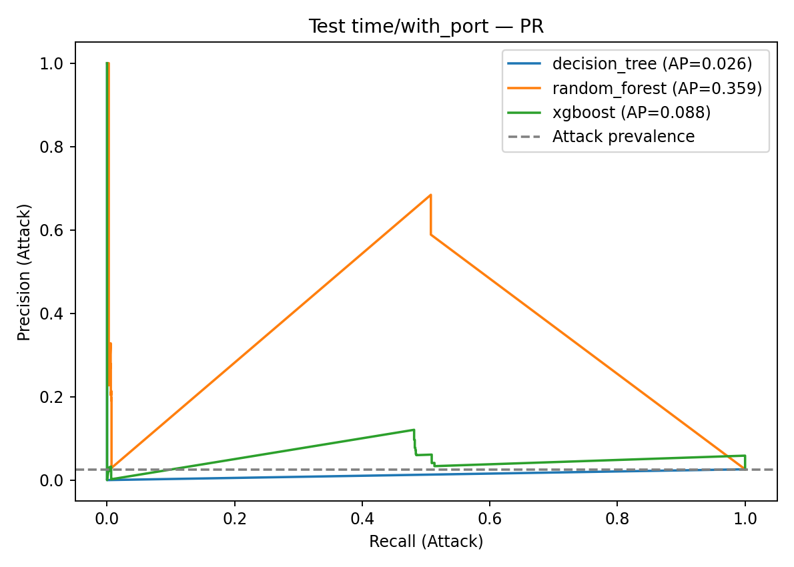
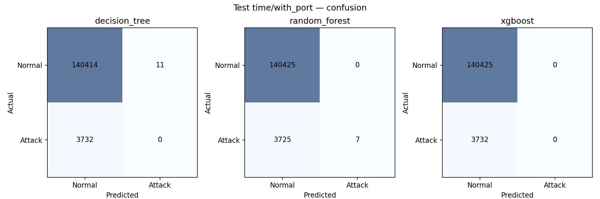

# Kết quả thực nghiệm (W3–W4)

Mô hình chọn trên Validation (time/with_port): **random_forest**. Không chọn lại theo Test.

Train time-based chỉ có FTP-Patator; Test chỉ có SSH-Patator. Kết quả chính là time/with_port. Random split là đối chứng rò rỉ.

## Validation winners

| Model | Split | Port | F1 | P | R | AP | FPR | FTP rec | SSH rec |
|---|---|---|---:|---:|---:|---:|---:|---:|---:|
| decision_tree | time | with_port | 0.7170 | 0.9971 | 0.5597 | 0.5690 | 0.0000 | 0.9962779156327544 | 0.0 |
| random_forest | time | with_port | 0.7181 | 1.0000 | 0.5602 | 0.7326 | 0.0000 | 0.9971050454921424 | 0.0 |
| xgboost | time | with_port | 0.7181 | 1.0000 | 0.5602 | 0.6045 | 0.0000 | 0.9971050454921424 | 0.0 |
| decision_tree | time | without_port | 0.7169 | 0.9967 | 0.5597 | 0.5676 | 0.0000 | 0.9962779156327544 | 0.0 |
| random_forest | time | without_port | 0.7134 | 0.9821 | 0.5602 | 0.5694 | 0.0002 | 0.9971050454921424 | 0.0 |
| xgboost | time | without_port | 0.7136 | 0.9841 | 0.5597 | 0.6874 | 0.0002 | 0.9962779156327544 | 0.0 |
| decision_tree | random | with_port | 0.9939 | 0.9900 | 0.9978 | 0.9970 | 0.0003 | 0.9997292174383968 | 0.995262390670554 |
| random_forest | random | with_port | 0.9997 | 1.0000 | 0.9994 | 0.9998 | 0.0000 | 0.9997292174383968 | 0.9989067055393586 |
| xgboost | random | with_port | 0.9995 | 0.9992 | 0.9998 | 0.9999 | 0.0000 | 0.9997292174383968 | 1.0 |
| decision_tree | random | without_port | 0.9799 | 0.9662 | 0.9941 | 0.9895 | 0.0011 | 0.9981045220687788 | 0.9887026239067056 |
| random_forest | random | without_port | 0.9942 | 0.9930 | 0.9953 | 0.9993 | 0.0002 | 0.9989168697535878 | 0.990524781341108 |
| xgboost | random | without_port | 0.9984 | 0.9984 | 0.9983 | 0.9999 | 0.0000 | 0.999458434876794 | 0.9967201166180758 |

## Test (mở một lần)

| Model | Split | Port | F1 | P | R | AP | FPR | FTP rec | SSH rec | chọn trước Test |
|---|---|---|---:|---:|---:|---:|---:|---:|---:|---|
| decision_tree | time | with_port | 0.0000 | 0.0000 | 0.0000 | 0.0259 | 0.0001 | nan | 0.0 |  |
| random_forest | time | with_port | 0.0037 | 1.0000 | 0.0019 | 0.3591 | 0.0000 | nan | 0.0018756698821007 | yes |
| xgboost | time | with_port | 0.0000 | 0.0000 | 0.0000 | 0.0879 | 0.0000 | nan | 0.0 |  |
| decision_tree | time | without_port | 0.0037 | 0.4375 | 0.0019 | 0.0272 | 0.0001 | nan | 0.0018756698821007 |  |
| random_forest | time | without_port | 0.0074 | 0.2414 | 0.0038 | 0.0268 | 0.0003 | nan | 0.0037513397642015 |  |
| xgboost | time | without_port | 0.0069 | 0.2653 | 0.0035 | 0.2447 | 0.0003 | nan | 0.0034833869239013 |  |
| decision_tree | random | with_port | 0.9942 | 0.9904 | 0.9980 | 0.9963 | 0.0003 | 1.0 | 0.9953560371517028 |  |
| random_forest | random | with_port | 0.9997 | 1.0000 | 0.9993 | 1.0000 | 0.0000 | 1.0 | 0.9984520123839008 |  |
| xgboost | random | with_port | 0.9997 | 0.9993 | 1.0000 | 1.0000 | 0.0000 | 1.0 | 1.0 |  |
| decision_tree | random | without_port | 0.9823 | 0.9700 | 0.9949 | 0.9890 | 0.0010 | 0.9969348659003832 | 0.9922600619195048 |  |
| random_forest | random | without_port | 0.9944 | 0.9934 | 0.9954 | 0.9994 | 0.0002 | 0.9973180076628352 | 0.9927760577915375 |  |
| xgboost | random | without_port | 0.9984 | 0.9980 | 0.9987 | 0.9999 | 0.0001 | 0.9992337164750956 | 0.997936016511868 |  |

Test time-based không có FTP-Patator (support = 0) — không kết luận phát hiện FTP trên Test.
Random split F1 cao là đối chứng rò rỉ, không phải kết quả chính.

