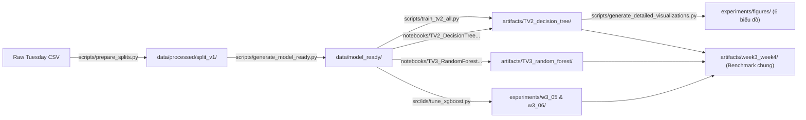

# Bản đồ Code và Kiến trúc Dự án (Code Map)

Tài liệu này mô tả chi tiết cấu trúc mã nguồn, trách nhiệm của từng thành phần và luồng dữ liệu (Data Pipeline) từ dữ liệu thô ban đầu đến các sản phẩm artifacts cuối cùng.

---

## 1. Bản đồ Thư mục & Trách nhiệm

```text
cicids-bruteforce-ids/
├── configs/
│   └── experiment.yaml                     # Cấu hình chuẩn: mốc thời gian cutoffs, allowlist features, hyperparameter grids
│
├── data/
│   ├── raw/                                # Dữ liệu thô (Tuesday-WorkingHours.pcap_ISCX.csv) [Không commit Git]
│   ├── processed/
│   │   ├── split_v1/                       # Checkpoint dữ liệu phân tách theo thời gian (train, val, test CSV)
│   │   └── random_split_v1/                # Checkpoint dữ liệu phân tách ngẫu nhiên
│   └── model_ready/                        # Dữ liệu chuẩn hóa sẵn sàng huấn luyện (chia 4 thư mục):
│       ├── time/with_port/                 # Time-based split có Destination Port (67 features) [W3-01]
│       ├── time/without_port/              # Time-based split bỏ Destination Port (66 features)
│       ├── random/with_port/               # Random split có Destination Port (67 features) [W3-02]
│       └── random/without_port/            # Random split bỏ Destination Port (66 features)
│
├── src/ids/                                # Package mã nguồn lõi của hệ thống
│   ├── __init__.py
│   ├── common.py                           # Tiện ích: quản lý lỗi ProtocolError, băm SHA-256, đọc ghi JSON/YAML
│   ├── schema.py                           # Chuẩn hóa tên cột, nhãn bài toán, danh sách đặc trưng cho phép (Allowlist)
│   ├── data.py                             # Bộ đọc dữ liệu thô theo chunk, parse thời gian cơ bản, kiểm tra tính toàn vẹn
│   ├── split.py                            # Thuật toán áp dụng mốc thời gian, bộ lọc Purge và Embargo
│   ├── preprocess.py                       # Sklearn transformer pipeline: ép kiểu số, loại cột hằng, điền median từ Train
│   ├── metrics.py                          # Tính toán Accuracy, Precision, Recall, F1, AP, ROC-AUC, Subtype Recalls
│   ├── train.py                            # Huấn luyện baseline 3 mô hình cây, chọn threshold trên Validation
│   ├── evaluate.py                         # Đánh giá Test đúng một lần (Single-open Test)
│   ├── explain.py                          # Phân tích SHAP TreeExplainer cho mô hình tốt nhất
│   ├── tune_decision_tree.py               # Script chuyên biệt: Tinh chỉnh siêu tham số Decision Tree (TV2)
│   ├── tune_xgboost.py                     # Script chuyên biệt: Tinh chỉnh siêu tham số XGBoost (TV4)
│   └── evaluate_tuned_model.py             # Script chuyên biệt: Đánh giá mô hình đã tune trên tập Test
│
├── scripts/                                # Các script tiện ích và tự động hóa
│   ├── prepare_splits.py                   # Script phục hồi timestamp 24h và tạo các tập phân tách ban đầu
│   ├── generate_model_ready.py             # Script chuẩn hóa và tách nhỏ thành dữ liệu data/model_ready/
│   ├── train_tv2_all.py                    # Master script huấn luyện và xuất artifacts toàn diện cho TV2
│   ├── generate_detailed_visualizations.py # Script sinh bộ 6 biểu đồ khoa học 300 DPI (Cây, Overfit, CM, PR/ROC, SHAP, Leakage)
│   └── smoke_test.py                       # Kiểm thử nhanh toàn bộ pipeline trên dữ liệu giả lập
│
├── notebooks/                              # Sổ tay nghiên cứu & trực quan hóa tương tác
│   ├── TV2_DecisionTree_W3-01_W3-02.ipynb  # Phân tích Cây quyết định: cấu trúc cây, quy tắc rẽ nhánh, khảo sát độ sâu quá khớp
│   └── TV3_RandomForest_W3-03_W3-04.ipynb  # Phân tích Rừng ngẫu nhiên: thực nghiệm W3-03/W3-04, port ablation và SHAP
│
├── artifacts/                              # Kho lưu trữ kết quả và mô hình chính thức
│   ├── TV2_decision_tree/                  # Artifacts chuyên biệt của TV2 (models .joblib, final_params.json, test/val CSVs, figures)
│   ├── TV3_random_forest/                  # Artifacts chuyên biệt của TV3 (models .joblib, docx bản nháp báo cáo)
│   └── week3_week4/                        # Benchmark hợp nhất cả 3 mô hình (RESULTS.md, test_comparison.csv, frozen.json)
│
├── experiments/                            # Kết quả chi tiết từ các phiên chạy thực nghiệm
│   ├── figures/                            # 6 biểu đồ PNG chất lượng cao phục vụ chèn vào báo cáo
│   ├── w3_01_dt_time/                      # Chi tiết tuning Decision Tree kịch bản thời gian
│   ├── w3_02_dt_random/                    # Chi tiết tuning Decision Tree kịch bản ngẫu nhiên
│   ├── w3_05_time_tuning/                  # Chi tiết tuning XGBoost kịch bản thời gian
│   └── w3_06_random_tuning/                # Chi tiết tuning XGBoost kịch bản ngẫu nhiên
│
└── docs/                                   # Toàn bộ tài liệu học thuật và báo cáo
    ├── BAO_CAO_THUC_NGHIEM_W3_W4.md        # Báo cáo thực nghiệm học thuật toàn diện
    ├── DATA_AND_PROTOCOL.md                # Quy chuẩn dữ liệu và protocol thực nghiệm
    ├── CODE_MAP.md                         # Bản đồ kiến trúc mã nguồn (tài liệu này)
    └── quy_trinh_thu_thap_tien_xu_ly_CICIDS2017.md # Phân tích EDA timeline và quy trình xử lý dữ liệu
```

---

## 2. Luồng Dữ liệu Toàn hệ thống (End-to-End Pipeline)



---

## 3. Mô tả Các Tệp Đầu vào & Đầu ra Quan trọng

| Tệp / Thư mục | Mục đích sử dụng | Nguồn gốc / Công cụ sinh |
|---|---|---|
| `data/model_ready/time/with_port/` | Bộ dữ liệu chuẩn cho kịch bản thời gian W3-01. Gồm `X_train.csv`, `X_validation.csv`, `X_test.csv` và các nhãn nhị phân / subtype tương ứng. | Sinh bởi `scripts/generate_model_ready.py` |
| `artifacts/TV2_decision_tree/dt_final_params.json` | Tóm tắt cấu hình tối ưu và chỉ số đánh giá của TV2 cho cả W3-01 và W3-02. | Sinh bởi `scripts/train_tv2_all.py` |
| `artifacts/week3_week4/test_comparison.csv` | Bảng tổng hợp đối chuẩn 3 mô hình (DT, RF, XGB) trên 2 split (time, random) và 2 không gian đặc trưng (with_port, without_port). | Sinh từ benchmark hợp nhất W3–W4 |
| `experiments/figures/*.png` | 6 biểu đồ khoa học có độ phân giải 300 DPI phục vụ bài báo cáo và slide thuyết trình. | Sinh bởi `scripts/generate_detailed_visualizations.py` |

---

## 4. Hợp đồng Ranh giới Dữ liệu (Data Boundary Contract)

1. **Huấn luyện (Train Phase)**:
   - Mô hình chỉ nhận các cột đặc trưng trong Allowlist (`features`).
   - Mọi transformer tiền xử lý (loại cột hằng số, tính toán median để điền khuyết thiếu, tính toán trọng số lớp `class_weight`) **chỉ được `fit` trên tập Train**.
2. **Kiểm định (Validation Phase)**:
   - Dữ liệu Validation chỉ đi qua `transform()` và `predict_proba()` để tìm siêu tham số tối ưu và ngưỡng quyết định (threshold).
   - Tuyệt đối không tính toán lại phương sai hay trọng số từ tập Validation.
3. **Đánh giá (Test Phase)**:
   - Mở duy nhất một lần sau khi mọi quyết định mô hình và siêu tham số đã được cố định hoàn toàn.
   - Không thực hiện bất kỳ thao tác refit hoặc điều chỉnh ngưỡng nào sau khi có kết quả Test.
