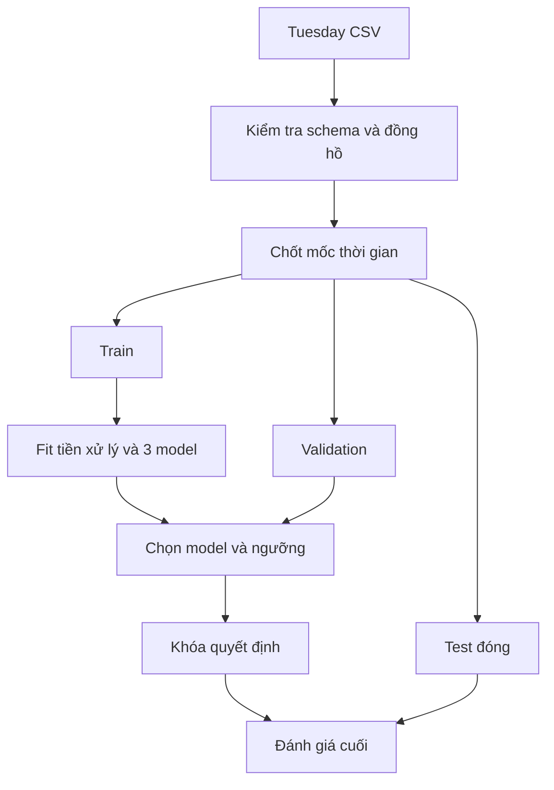

# Dữ liệu và protocol thực nghiệm

## 1. Dữ kiện đã xác minh và việc còn phải kiểm tra

Trang gốc UNB phân biệt `GeneratedLabelledFlows.zip` với `MachineLearningCSV.zip`, mô tả labelled flows có metadata và công bố lịch tấn công Tuesday. Tên bản mirror không bảo đảm schema hay cách biểu diễn đồng hồ. Repo chưa được cung cấp CSV thật nên **chưa xác minh header, số dòng, phân bố nhãn, múi giờ hay chất lượng timestamp của file nhóm sẽ dùng**. [UNB CICIDS2017](https://www.unb.ca/cic/datasets/ids-2017.html)

Quy trình nhận dữ liệu:

1. Ghi URL thực lấy file, ngày tải, tên archive, tên member Tuesday, nguồn gốc/bản đã sửa nếu có.
2. Kiểm tra header có `Label`, `Timestamp`, `Flow Duration`, và tối thiểu số feature trong config.
3. Xem vài dòng Timestamp đầu/cuối và theo nhãn; không mặc định thứ tự dòng là thứ tự thời gian.
4. Khai báo `timestamp_formats` chính xác. `%d/%m/%Y` và `%m/%d/%Y` khác nhau ngay với `04/07/2017`.
5. Kiểm tra 24 giờ/AM-PM, múi giờ nguồn và độ chính xác đến phút/giây. Nếu file mất AM/PM, không suy giờ bằng `Label` hoặc `Destination Port`. Tìm nguồn có timestamp đáng tin cậy; nếu cần hiệu chỉnh, phải có metadata độc lập, quy tắc và phiên bản riêng.
6. Kiểm tra đơn vị duration: repo hỗ trợ microsecond cho bản CIC2017 đang nhắm đến. Sai đơn vị làm sai purge, kể cả model vẫn train được.

Không tự gán giờ từ lịch tấn công vào các dòng mất Timestamp. Không ghép hai bản CSV theo số thứ tự dòng trừ khi đã chứng minh tương ứng một-một bằng provenance độc lập; repo không cung cấp thao tác ghép đó.

## 2. Định nghĩa bài toán

| Nhãn gốc sau chuẩn hóa | Nhãn nhị phân | Cách xử lý |
|---|---:|---|
| BENIGN | 0 | Giữ |
| FTP-PATATOR | 1 | Giữ, lưu subtype riêng |
| SSH-PATATOR | 1 | Giữ, lưu subtype riêng |
| Nhãn khác / thiếu | — | Loại khỏi phạm vi, thống kê số loại |

Một dòng là một flow hoàn tất. Các chỉ số tổng packet/byte, duration và IAT thường cần quan sát toàn flow. Do đó đầu ra là **phân loại sau khi có thống kê flow**, không phải phát hiện ngay packet đầu hay đo detection latency.

Không kết luận một flow “Normal” có nghĩa người dùng/host an toàn. Đây là dự đoán theo hai lớp và phân bố trong thí nghiệm.

## 3. Thứ tự dữ liệu và ranh giới fit

**Trước split được phép:** strip/canonical tên cột, lọc đúng định nghĩa nhãn, parse thời gian theo format đã khai báo, ép số, đổi `NaN/Infinity` thành thiếu theo quy tắc cố định, audit metadata, nhận diện bản ghi xuất trùng. Những thao tác này không học tham số thống kê từ cả tập.

**Chỉ fit trên Train:** quyết định cột hằng/toàn thiếu, median điền thiếu, trọng số lớp, cây và ensemble. Mỗi mô hình là một `sklearn.Pipeline`; Validation/Test chỉ đi qua `transform` và `predict_proba`. Cách dùng Pipeline và fit trên Train phù hợp hướng dẫn tránh leakage của scikit-learn. [scikit-learn: Common pitfalls](https://scikit-learn.org/stable/common_pitfalls.html)

**Chỉ chọn trên Validation:** threshold và model trong tập ứng viên đã công bố. Bản 3 ngày không grid-search tham số, không dùng SHAP để chọn thêm feature, không retrain Train+Validation sau khi chốt threshold. Nếu refit model thì score scale có thể đổi và threshold cũ không còn được kiểm chứng; đây là lý do giữ nguyên các model đã fit.

## 4. Quy tắc split chính xác

Với từng flow: `s = Timestamp`; `e = s + Flow Duration + q`, trong đó `q` là sai số độ chính xác timestamp khai báo, tính bằng giây. Với timestamp chỉ ghi phút, ví dụ `q=60` tạo cận trên bảo thủ khi thời điểm thật đã bị làm tròn xuống. Nếu kiểu làm tròn/đồng hồ khác, phải xác minh thay vì xem công thức là tự động đúng.

Gọi `a` là mốc hết Train, `b` là mốc hết Validation, `g` là embargo:

| Tập | Điều kiện giữ |
|---|---|
| Train | `e < a` |
| Validation | `s >= a + g` và `e < b` |
| Test | `s >= b + g` |
| Bị loại ở ranh giới | Không thỏa điều kiện tập nào |

Purge tránh để một flow bắt đầu trong Train nhưng hoàn tất sau khi giai đoạn Validation đã bắt đầu. Embargo bỏ vùng bắt đầu ngay sau mỗi mốc. Repo báo số dòng và nhãn bị loại; không âm thầm bỏ.

`embargo_seconds=120` là **lựa chọn kỹ thuật minh họa**, không có bằng chứng nó làm các flow độc lập hay xóa mọi leakage. Các flow của cùng campaign vẫn có thể tương tự nhau dù cách nhau hơn hai phút.

Mốc minh họa, **chỉ dùng khi audit của CSV thật xác nhận phù hợp**:

| Tập | Phần ngày minh họa | Subtype dự kiến theo lịch công bố |
|---|---|---|
| Train | Flow hoàn tất trước 14:20 | BENIGN, FTP, SSH đoạn đầu |
| Validation | Flow bắt đầu từ 14:22, hoàn tất trước 14:40 | BENIGN, SSH |
| Test | Flow bắt đầu từ 14:42 tới cuối dữ liệu | BENIGN, SSH nếu còn support |

Chia như vậy đánh giá phần muộn của cùng chiến dịch, không chứng minh tổng quát hóa sang chiến dịch mới. Hai lớp nhị phân đều hiện diện là điều kiện cần để tính chỉ số, không bảo đảm đủ số sự kiện độc lập.

`min_per_binary_class=30` chỉ là ngưỡng dừng vận hành do repo đề xuất. Không có định lý “30 flow là đủ ý nghĩa thống kê”; các flow phụ thuộc có thể tương ứng rất ít sự kiện độc lập. Luôn báo support thực tế và độ tập trung trong thời gian. Không báo khoảng tin cậy iid/bootstrap theo dòng như thể mọi flow độc lập.

## 5. Nhìn nhãn toàn ngày trước khi split có phải leakage không?

Đây là **thiết kế hồi cứu có audit nhãn/thời gian**: dùng lịch và số lượng nhãn để đặt câu hỏi đánh giá có thể thực hiện. Nó khác với xem điểm dự đoán Test rồi dời mốc cho điểm đẹp. Vẫn phải công khai rằng mốc không hoàn toàn độc lập với phân bố nhãn.

Sau khi audit, khóa mốc và cấu hình. Không thử nhiều cutoffs dựa trên F1/Test. Nếu lựa chọn mốc được tối ưu theo hiệu năng thì Test không còn độc lập với quá trình chọn thiết kế.

## 6. Chính sách feature và duplicate

| Vấn đề | Chính sách trong code | Giới hạn |
|---|---|---|
| Flow ID, IP, Timestamp, Label | Không nằm trong allowlist | Timestamp và Label vẫn giữ ở metadata cho audit |
| Destination/Source Port | Bỏ từ đầu, không ablation | Không có bằng chứng định lượng việc bỏ cổng làm tốt hơn |
| Protocol | Bỏ để giữ schema chỉ gồm thống kê flow | Đây là lựa chọn thu hẹp, không kết luận protocol vô ích |
| Cột số lạ, `Unnamed`, nhãn mã hóa | Không tự động thêm vào model | Bản export tên cột khác cần map có kiểm chứng |
| Fwd Header Length bản lặp `.1` | Không thuộc allowlist | Không học hai cột tên khác nhưng thực chất trùng |
| Cột hằng/toàn thiếu trên Train | Loại bằng transformer được fit trên Train | Không dùng variance Validation/Test để giữ lại |
| Bản ghi raw trùng cả metadata/feature | Giữ bản sớm nhất trong thứ tự đã định | Fingerprint không phát hiện mọi lỗi gần-trùng |
| Cùng bản ghi nhưng nhãn mâu thuẫn | Dừng, điều tra provenance | Không vote nhãn theo đa số |
| Feature vector giống nhau, flow khác | Giữ trong phân bố chính; gắn cờ xuất hiện ở tập trước | Không tự xóa Test chỉ vì giống Train |

Lý do không xóa mọi feature duplicate xuyên tập: traffic hợp lệ có thể lặp lại; xóa chúng sẽ đổi phân bố Test thành “chỉ các mẫu mới” mà không báo. Repo giữ kết quả Test chính và thêm một thống kê mô tả trên phần feature vector chưa xuất hiện trong các tập sớm hơn. Thống kê này không phải split đối chứng mới, không phải kiểm định campaign độc lập và không là căn cứ chọn model.

Các cột được bỏ dựa trên quy tắc thiết kế trước khi chạy. Cổng dịch vụ có thể là thông tin hữu ích trong IDS thật; ở đây bỏ để hạn chế shortcut gắn với setup thí nghiệm, không tuyên bố cổng luôn là leakage.

## 7. Mô hình, trọng số và chọn threshold

| Mô hình | Preset | Xử lý mất cân bằng |
|---|---|---|
| Decision Tree | depth 8, leaf tối thiểu 10 | `class_weight="balanced"` |
| Random Forest | 150 cây, depth 16, leaf tối thiểu 5, 2 luồng | `class_weight="balanced"` |
| XGBoost | 200 cây, depth 4, learning rate 0.08, CPU histogram, 2 luồng | `scale_pos_weight = N_Normal_train / N_Attack_train` |

Đây là preset khởi đầu có giới hạn chi phí, không phải tham số tối ưu đã chứng minh. Trọng số được tính từ Train; không tính trên cả dữ liệu. Không thêm sample_weight lặp lại cùng trọng số để tránh nhân đôi tác động. XGBoost mô tả `scale_pos_weight` và lựa chọn `hist` trong tài liệu tham số. [XGBoost 3.0](https://xgboost.readthedocs.io/en/release_3.0.0/parameter.html)

Threshold grid cố định 0.05, 0.10, …, 0.95. Với mỗi model: chọn F1 Attack cao nhất trên Validation; nếu bằng nhau ưu tiên FPR thấp, Recall cao, rồi ngưỡng lớn hơn. Chọn giữa các model theo F1, AP, FPR, cuối cùng thứ tự model đã khai báo. Các quy tắc đều khóa trước Test.

Đồng thời lưu chỉ số tại threshold 0.5 để thấy tác động của việc chọn threshold. Không gọi `model_score=0.8` là “80% chắc chắn bị tấn công” vì chưa hiệu chuẩn; class weights càng khiến diễn giải xác suất trực tiếp cần thận trọng.

Validation nằm trong đợt tấn công, còn Test có thể kéo dài nhiều giờ BENIGN sau đó. Tỷ lệ Attack vì vậy có thể khác mạnh, khiến Precision/F1 và ngưỡng chọn theo Validation kém ổn định trên Test. Báo tỷ lệ lớp từng tập, FPR và số FP; không chỉnh ngưỡng lại theo Test để che khác biệt này. Đây là giới hạn thực nghiệm phải thảo luận.

## 8. Đánh giá và diễn giải

| Chỉ số | Cần đọc như thế nào |
|---|---|
| Precision Attack | Trong các flow báo Attack, phần nào đúng |
| Recall Attack | Trong các flow Attack có nhãn, phát hiện được bao nhiêu |
| F1 Attack | Cân bằng Precision/Recall, dùng chọn model ở thí nghiệm này |
| Average Precision (AP) | Chất lượng xếp hạng qua các threshold; ghi rõ hàm `average_precision_score` |
| FPR = FP/(FP+TN) | Tỷ lệ flow BENIGN bị báo nhầm; không đồng nhất `1 - Precision` |
| FP, FN và support | Số báo nhầm/bỏ sót và mẫu thật; tránh chỉ nhìn tỷ lệ |
| Accuracy / ROC-AUC | Bổ sung, không thay thế các chỉ số trên |
| Recall theo FTP/SSH | Chỉ tính khi subtype đó có support; ngược lại N/A |

Một lần mở Test có thể tính tất cả model đã khóa và nhiều metric đã khai báo trong cùng phiên. Điều không được làm là chọn lại model/ngưỡng sau khi biết Test. Nếu model thua Validation lại thắng Test, vẫn ghi model đã chọn ban đầu và thảo luận tính không ổn định.

Dummy majority là đối chiếu rẻ: luôn dự đoán lớp đông hơn trong Train. Baseline này giúp phát hiện trường hợp Accuracy cao chỉ vì dữ liệu nhiều BENIGN; nó không thay thế Decision Tree baseline.

Không tự đặt ngưỡng “F1 > 99% mới đạt”, không suy F1 cao thành không leakage, không suy F1 thấp hoàn toàn do pipeline sai. Sai timestamp, subtype chưa thấy, thay đổi phân bố, phụ thuộc giữa flow và chất lượng nhãn đều có thể ảnh hưởng.

## 9. SHAP vừa đủ và đúng nghĩa

Repo dùng `TreeExplainer`, `tree_path_dependent`, `model_output="raw"`. Lấy tối đa 500 dòng Validation ngẫu nhiên với seed cố định sau khi đã chọn model; sample ID và phân bố nhãn được lưu. Bắt đầu 100–500 dòng là đủ cho mục tiêu minh họa, không cần mặc định 2.000–5.000. Cần nhiều hơn thì quyết định trước khi chạy chính thức và dành thời gian tương ứng.

Background ở chế độ này là số mẫu Train đi qua các nhánh đã lưu trong model, không phải toàn bộ Test. XGBoost giải thích raw margin/log-odds; cây sklearn giải thích đầu ra score của mô hình. Code xử lý chiều output Attack và kiểm tra tính cộng được: `base + sum(SHAP) ≈ output`. [SHAP TreeExplainer](https://shap.readthedocs.io/en/latest/generated/shap.TreeExplainer.html)

SHAP giải thích model dùng gì để ra quyết định, không chứng minh feature gây ra tấn công. Feature tương quan làm attribution phụ thuộc giả định của explainer. Không xếp hạng SHAP rồi quay lại đổi feature sau khi đã mở Test.

## 10. Điều kiện nghiệm thu thực tế

- Đã xác minh timestamp của đúng file dùng; metadata còn nguyên trong checkpoint.
- Cả ba tập giữ thứ tự và đủ hai lớp sau purge; ghi support từng subtype.
- Schema đầu vào không có nhãn/định danh/cổng; mọi fit dựa trên Train.
- Cả ba model chạy cùng split, giữ preprocessing trong file model.
- Model/ngưỡng khóa bằng Validation; Test không dùng để chọn lại.
- Bảng, hình và tệp dự đoán nhất quán; ghi phiên bản, seed, hash.
- Báo cáo thừa nhận giới hạn cùng ngày/campaign, nhãn thiếu support và đánh giá sau flow.
- SHAP/CLI thiếu thì ghi đúng trạng thái; không dùng output giả lập làm kết quả thật.
