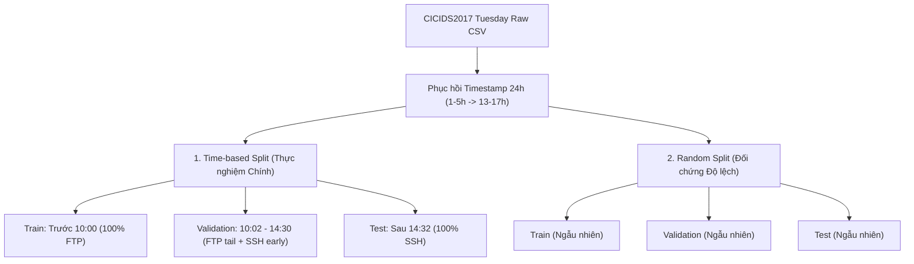

# Quy chuẩn Dữ liệu và Protocol Thực nghiệm (Canonical Protocol)

Tài liệu này xác định chuẩn mực khoa học và giao thức thực nghiệm duy nhất được áp dụng cho toàn bộ đồ án nghiên cứu phát hiện tấn công Brute Force (FTP/SSH) trên tập dữ liệu **CICIDS2017 Tuesday**.

---

## 1. Dữ liệu Nguồn & Xác minh Tính Toàn vẹn

- **Tệp nguồn chuẩn**: `Tuesday-WorkingHours.pcap_ISCX.csv` (Trích xuất từ gói `GeneratedLabelledFlows.zip` của Canadian Institute for Cybersecurity, UNB).
- **Mã băm SHA-256 đã xác minh**:
  ```text
  ae9c88e10c41a8eb1ff454ae98bc513454925097d0b0b57180f94e79de445815
  ```
- **Định dạng Timestamp gốc**: `dd/MM/yyyy HH:mm:ss` hoặc `dd/MM/yyyy H:mm`.
- **Đơn vị thời lượng flow (Flow Duration)**: Microseconds ($\mu s$).

### ⚠️ Quy tắc Phục hồi Đồng hồ 24 Giờ (Timestamp Reconstruction Policy)
Trong quá trình Khám phá Dữ liệu (EDA) trên tệp CSV Tuesday gốc, hệ thống ghi nhận lỗi chuyển đổi AM/PM của công cụ xuất CICFlowMeter:
- Các flow diễn ra trong khoảng giờ **8:00 – 12:00** thuộc buổi sáng/trưa (giữ nguyên).
- Các flow ghi nhận giờ **1:00 – 5:00** thực chất diễn ra vào buổi chiều. Quy tắc phục hồi chuẩn mực được triển khai tại `scripts/prepare_splits.py` (hàm `reconstruct_timestamp()`): **cộng thêm 12 giờ để đưa về khung 13:00 – 17:00**.
- **Lưu ý kiểm soát leakage**: Quy tắc phục hồi này áp dụng độc lập với nhãn tấn công (`Label`) và cổng mạng (`Destination Port`), chỉ dựa thuần túy trên phân bố dòng thời gian EDA của toàn bộ traffic trong ngày.

---

## 2. Định nghĩa Bài toán & Không gian Nhãn

Bài toán được định nghĩa là **phân loại nhị phân offline trên các flow mạng đã hoàn tất**:

| Nhãn gốc trong dữ liệu | Nhãn nhị phân ($y$) | Xử lý | Ghi chú bảo mật |
|---|:---:|---|---|
| `BENIGN` | 0 | Giữ nguyên | Traffic mạng bình thường |
| `FTP-Patator` | 1 | Gán nhãn 1, lưu subtype riêng | Tấn công dò quét mật khẩu FTP (Port 21) |
| `SSH-Patator` | 1 | Gán nhãn 1, lưu subtype riêng | Tấn công dò quét mật khẩu SSH (Port 22) |
| Nhãn khác / thiếu | — | Loại khỏi tập dữ liệu | Đảm bảo tính nhất quán bài toán |

> **Bản chất kỹ thuật**: Vì các đặc trưng thống kê (tổng byte, tổng packet, IAT, duration) chỉ được tính toán sau khi flow đã đóng (kết thúc bằng cờ FIN/RST hoặc timeout), hệ thống phân loại này hoạt động ở tầng **Post-Flow Inspection**, không đo đạc độ trễ phát hiện thời gian thực (detection latency) ở từng packet đầu tiên.

---

## 3. Thiết kế Phân tách Dữ liệu (Splitting Strategies)

Dự án thiết kế **2 chiến lược phân tách dữ liệu song song** nhằm trả lời trực tiếp các câu hỏi nghiên cứu:



### 3.1. Phân tách theo Thời gian (Time-based Split) — Kết quả Đánh giá Chính
- **Mục tiêu**: Đánh giá khả năng tổng quát hóa thực tế của mô hình khi triển khai trong môi trường mạng sản xuất (huấn luyện trên dữ liệu quá khứ, kiểm định và vận hành trên dữ liệu tương lai).
- **Quy tắc Purge và Embargo**:
  - Với mỗi flow có thời điểm bắt đầu $s$ và thời lượng $d$, thời điểm hoàn tất bảo thủ là $e = s + d + q$ (với sai số làm tròn phút $q = 60s$).
  - Embargo $g = 120s$ được áp dụng tại ranh giới các tập để ngăn cách các flow chồng lấn.
- **Các mốc thời gian chốt trước (Audited Cutoffs)**:
  - **Mốc A** = `2017-07-04 10:00:00`
  - **Mốc B** = `2017-07-04 14:30:00`
- **Phân bố Subtype thực tế qua các tập**:
  - **Train** ($e < A$): Chỉ chứa `FTP-Patator` (~68% chiến dịch FTP buổi sáng). Hoàn toàn **không có `SSH-Patator`**.
  - **Validation** ($s \ge A + g$ và $e < B$): Chứa đoạn đuôi của `FTP-Patator` (~32%) và giai đoạn đầu của `SSH-Patator` (~34%). Dùng để tinh chỉnh siêu tham số và chọn ngưỡng.
  - **Test** ($s \ge B + g$): Chỉ chứa `SSH-Patator` (~66% chiến dịch SSH buổi chiều). Hoàn toàn **không có `FTP-Patator`**.

👉 **Ý nghĩa học thuật**: Tập Test theo thời gian tạo thành một bài toán **Zero-Shot Subtype Transfer** khắt khe: Mô hình được huấn luyện hoàn toàn trên tấn công FTP nhưng phải phát hiện tấn công SSH chưa từng xuất hiện trong tập Train!

### 3.2. Phân tách Ngẫu nhiên (Random Split) — Thực nghiệm Đối chứng
- **Mục tiêu**: Làm đối chứng đo lường **Hiện tượng ước lượng hiệu năng quá lạc quan (Optimistic Evaluation Bias)**.
- **Cơ chế**: Xáo trộn ngẫu nhiên toàn bộ các flow trong ngày Tuesday thành 3 phần tỷ lệ tương ứng.
- **Diễn giải khoa học**: Không vội kết luận là "chứng minh data leakage"; điểm số F1 cao (~99.9%) trong Random split phản ánh rằng **các flow thuộc cùng một đợt tấn công brute force (cùng IP, cùng nhịp gõ, cùng cấu hình công cụ) đã bị chia đều vào cả Train và Test**. Mô hình chỉ cần "học thuộc lòng" đặc trưng chiến dịch thay vì học quy luật tổng quát.

---

## 4. Không gian Đặc trưng & Thực nghiệm Loại bỏ Cổng (Port Ablation)

Mọi pipeline chỉ sử dụng các cột thống kê đặc trưng mạng nằm trong **Allowlist**:
- **Bị loại bỏ từ đầu**: Các cột định danh (`Flow ID`, `Source IP`, `Destination IP`, `Timestamp`, `Protocol`).
- **Thực nghiệm Port Ablation**:
  1. **Nhánh `with_port` (67 đặc trưng)**: Bao gồm cột `Destination Port` (Cổng 21 cho FTP, Cổng 22 cho SSH).
  2. **Nhánh `without_port` (66 đặc trưng)**: Loại bỏ hoàn toàn `Destination Port`, chỉ giữ lại các đặc trưng thống kê hành vi gói tin (Packet lengths, Flow IAT, Flags, Header lengths).
- **Mục đích**: Kiểm chứng xem mô hình có bị "học vẹt" (overfit) vào cổng dịch vụ hay không. Khi không còn thông tin cổng, mô hình có nhận diện được hành vi brute force qua thống kê kích thước gói tin và thời gian hay không.

---

## 5. Ranh giới Fit & Hai Chế độ Đánh giá Mô hình (Model Regimes)

Để đảm bảo tính minh bạch và tránh gây hiểu lầm trong báo cáo, dự án phân định rõ ràng **2 chế độ huấn luyện (Regimes)** đã được triển khai:

### Chế độ 1: Canonical Strict Zero-Shot Regime (Chuẩn mực Khoa học Chính)
- **Áp dụng trong**: Benchmark hợp nhất `artifacts/week3_week4/test_comparison.csv` và `RESULTS.md`.
- **Nguyên tắc**: Mô hình **chỉ được fit trên tập Train** (duy nhất `FTP-Patator`).
- **Validation**: Chỉ đi qua `predict_proba` để chọn cấu hình siêu tham số và ngưỡng tối ưu.
- **Test**: Đánh giá đúng một lần duy nhất trên tập Test (duy nhất `SSH-Patator`).
- **Kết quả thực tế**: Cả Decision Tree, Random Forest và XGBoost đều có **Test F1 $\le$ 0.0037 và SSH Recall $\le$ 0.19%** (thất bại hoàn toàn trước zero-shot transfer khi có port).

### Chế độ 2: Subtype-Aware / Refit Regime (Thực nghiệm Mở rộng có tiếp xúc SSH)
- **Áp dụng trong**: Script tuning `src/ids/tune_xgboost.py` (TV4).
- **Cơ chế**: Sử dụng `RandomizedSearchCV` với custom CV trên `X_combined = pd.concat([X_train, X_val])`. Do mặc định của thư viện là `refit=True`, mô hình sau khi chọn tham số tối ưu đã được **tự động fit lại trên toàn bộ tập gộp Train + Validation**.
- **Tác động**: Vì tập Validation có chứa 1,886 flow `SSH-Patator`, mô hình XGBoost trong chế độ này **đã được học trước mẫu SSH** trước khi đánh giá trên Test.
- **Kết quả thực tế**: Test F1 nhảy vọt lên **~0.9910**.
- **Quy tắc báo cáo**: Báo cáo **bắt buộc phải ghi rõ đây là chế độ đã tiếp xúc với subtype SSH (Seen Subtype Evaluation)**, dùng làm đối chứng chuyên sâu để giải thích tầm quan trọng của việc kiểm soát ranh giới dữ liệu trong MLOps/NIDS, tuyệt đối không trình bày lẫn lộn với kết quả Zero-Shot của Chế độ 1.

---

## 6. Xử lý Mất cân bằng Lớp & Lựa chọn Siêu tham số

- **Trọng số lớp**: Chỉ được tính toán từ phân bố tập **Train**:
  - Decision Tree & Random Forest: `class_weight='balanced'` tính theo công thức:
    $$w_c = \frac{N_{train}}{2 \cdot N_{train, c}}$$
  - XGBoost: `scale_pos_weight = N_Normal_train / N_Attack_train`.
- **Không gian Siêu tham số cốt lõi**:
  - **Decision Tree**: `criterion` (`gini`, `entropy`), `max_depth` (4, 6, 8, 12, None), `min_samples_leaf` (5, 10, 20).
  - **Random Forest**: `n_estimators` (100, 150, 300), `max_depth` (10, 16, None), `min_samples_leaf` (5, 10).
  - **XGBoost**: `n_estimators` (100, 200), `max_depth` (3, 4, 6), `learning_rate` (0.05, 0.08, 0.1).

---

## 7. Quy tắc Đánh giá & Báo cáo Khoa học (Evaluation Protocol)

1. **Nguyên tắc "Mở Test một lần" (Single-open Test Rule)**: Không tinh chỉnh siêu tham số, không đổi threshold, không refit mô hình sau khi đã mở tập Test.
2. **Hệ thống chỉ số bắt buộc**:
   - **F1-Score (Positive Class)**: Thước đo chính để cân bằng Precision và Recall trên lớp tấn công.
   - **Average Precision (AP)**: Đánh giá chất lượng xếp hạng xác suất trên đường cong PR.
   - **False Positive Rate (FPR)**: Tỷ lệ báo động giả trên tổng số flow bình thường ($FPR = \frac{FP}{FP + TN}$).
   - **Tỷ lệ phát hiện theo dạng tấn công (Subtype Recall)**: Đo riêng rẽ cho `FTP-Patator` và `SSH-Patator`. Nếu tập dữ liệu không có support của subtype đó (như FTP trong Test), bắt buộc ghi nhận là **`N/A`** (không được ghi 0% hoặc 100%).
3. **Phân tích Khả năng Diễn giải (Interpretability)**:
   - Sử dụng **SHAP TreeExplainer** trên tập Validation để phân tích tầm quan trọng của đặc trưng (Mean Absolute SHAP Value).
   - Sử dụng **Trực quan hóa Cây (`plot_tree`)** và **Trích xuất Quy tắc (`export_text`)** để làm rõ các lát cắt quyết định của Decision Tree.
